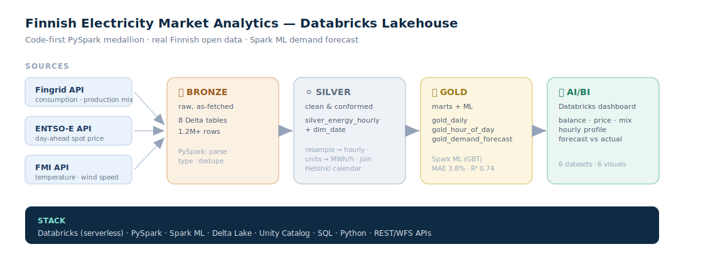

# Finnish Electricity Market Analytics — Databricks Lakehouse

End-to-end **PySpark medallion lakehouse** on **Databricks** over real Finnish open data:
electricity consumption, production mix, day-ahead price and weather — cleaned, modelled,
forecast, and surfaced in a native Databricks AI/BI dashboard.

> Companion to my [Microsoft Fabric retail project](https://github.com/JuliaVMosina) —
> that one is the low-code path (Data Factory + T-SQL warehouse); this one is the
> **code-first Spark path**: PySpark notebooks, Delta tables, Spark ML, Unity Catalog.



---

## What it does

```
  Fingrid API        ENTSO-E API         FMI API
 (consumption,      (day-ahead spot     (temperature,
  production mix)     price, FI zone)     wind speed)
        │                  │                  │
        └──────────────────┼──────────────────┘
                           ▼
   BRONZE   raw, as-fetched           8 Delta tables · 1.2M+ rows
                           │   PySpark: parse · type · dedupe
                           ▼
   SILVER   clean & conformed         silver_energy_hourly (12,407 h) + dim_date
                           │   resample 3-min/15-min → hourly · harmonise units → MWh/h
                           │   join all sources on the hour · Helsinki-local calendar
                           ▼
   GOLD     marts + ML forecast       gold_daily · gold_hour_of_day · gold_demand_forecast
                           │   Spark ML (GBT) demand forecast
                           ▼
            Databricks AI/BI dashboard
```

## Results & insights
- **Finland is a net electricity importer** — production averages 9,100 MWh/h vs 9,624 MWh/h demand.
- **Spot price rises as temperature falls** — cold snaps drive electric-heating demand.
- **Renewables ≈ 42%** of generation on average; wind's share grows noticeably toward winter.
- **Demand forecast** (Spark ML GBT, honest 90-day time holdout):
  **MAE 366 MWh = 3.8 %** of average demand, **R² 0.74**.
  Top drivers: *yesterday's demand* (lag-24h) and *temperature*.

## Tech stack
Databricks (Free Edition, serverless) · PySpark · Spark ML · Delta Lake · Unity Catalog ·
SQL · Python · REST/WFS APIs · Databricks AI/BI dashboards.

---

## Pipeline

| Layer | Notebook | Output |
|-------|----------|--------|
| Bronze | [`01_bronze_ingest_databricks.py`](notebooks/01_bronze_ingest_databricks.py) | `bronze_fingrid_*`, `bronze_fmi_weather`, `bronze_entsoe_price` |
| Silver | [`02_silver_transform.py`](notebooks/02_silver_transform.py) | `silver_energy_hourly`, `silver_dim_date` |
| Gold | [`03_gold_marts.py`](notebooks/03_gold_marts.py) | `gold_daily`, `gold_hour_of_day`, `gold_demand_forecast` |
| Dashboard | [`dashboard/dashboard_queries.sql`](dashboard/dashboard_queries.sql) | 6 AI/BI datasets |

### Engineering notes (the messy-real-data part)
- **Mixed resolutions** — sources arrive at 3-min (MW), 15-min and hourly (MWh/h);
  all resampled to a common **hourly** grain in silver.
- **Mixed units** — power (MW) vs energy-rate (MWh/h) vs kWh, harmonised to **MWh per hour**.
- **Rate limits** — Fingrid throttles to 1 req / 2 s; FMI rejects long intervals,
  so weather is pulled in 7-day chunks at hourly `timestep`.
- **Time zones** — all sources stored in UTC; reporting calendar is `Europe/Helsinki`.

### Honesty notes
- `solar` is Fingrid's **forecast** series (Finland has little metered solar) — labelled as such.
- The forecast uses **actual** weather as a feature; a production day-ahead model would use
  *forecast* weather. Lag features (24 h / 168 h) are known at day-ahead time, so the holdout is fair.
- Day-ahead price was **hourly** for most of the window (Finland moved to 15-min later).

---

## Data sources & access
| Source | Data | Auth |
|--------|------|------|
| [Fingrid Open Data](https://data.fingrid.fi/en) | consumption (124), production (74), wind (181), nuclear (188), hydro (191), solar fc (247) | free `x-api-key` |
| [ENTSO-E Transparency](https://transparency.entsoe.eu/) | day-ahead price, zone `10YFI-1--------U` | free token |
| [FMI Open Data](https://opendata.fmi.fi/wfs) | temperature, wind speed | none |

Keys are read from notebook variables and **never committed** (see `.gitignore`).
`fetch_sample.py` validates all three APIs locally before running anything in Databricks.

## Reproduce
1. Sign up for [Databricks Free Edition](https://www.databricks.com/learn/free-edition).
2. Get a Fingrid key + ENTSO-E token (see table above).
3. Run notebooks `01 → 02 → 03` (set keys in the config cell of `01`).
4. Build the AI/BI dashboard from `dashboard/dashboard_queries.sql`.
